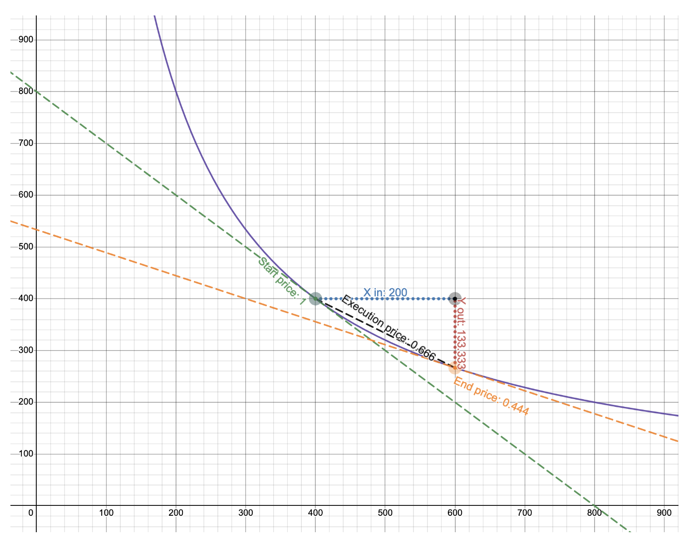

[TOC]
### some notes about uniswapV3
> 参考文档  https://y1cunhui.github.io/uniswapV3-book-zh-cn/

#### 学习顺序建议
1. 以本文的参考文档为入口，掌握核心原理
   1. 集中流动性的
   2. 费用的收集，分发
2. 从github中深入源代码
   1. https://github.com/Uniswap/v3-core.git
   2. https://github.com/Uniswap/v3-periphery.git
      1. 此部分重点
         1. positionManager  - LP相关
         2. swapRouter - 交易者相关
            1. 不过目前官网使用了universal Router 代替了swapRouter
   3. https://github.com/Uniswap/universal-router.git
      1. 更灵活，更通用的router
3. tenderly进行simulator学习
   1. swap示例 
      1. > https://dashboard.tenderly.co/poodlepp/somethingnew/tx/arbitrum/0x1da40c110de8e27bd08f357d435c2abb05993589435c2969578c7c1d89709837
   2. mint示例
      1. > https://dashboard.tenderly.co/poodlepp/somethingnew/tx/arbitrum/0x866de09ac9eae73f2b4f283ff57adb7390e7f038d7ab359b53c6b02d254863c5

#### milestone0
##### 集中流动性，tick, x-y-L-P
- 做市商AMM
  - 恒定函数做市商 (Constant Function Market Makers) CFMM
  - 
- 流动性
- AMM
- pool
- V2的缺点
  - 不适合稳定币，CURVE更适合
  - 资产利用率不足
- V3
  - 集中流动性
    - LP选择提供流动性的范围，更多的流动性提供在狭窄的空间
    - 许多的价格区间，区间内与v2类似
  - 公式
    - $L = \sqrt{xy}$
    - $\sqrt{P} = \sqrt{\frac{y}{x}}$
    - 平方根直接存储，而不是立即计算
    - $L = \frac{\Delta y}{\Delta \sqrt P}$
    - 可以得出x y  L  P 之前的关系
  - ticks
    - $p(i) = 1.0001^i$
    - 我们会用 Q64.96定点数 存储 $\sqrt P$
      - 也就是说 P不开根号的取值范围是 $2^{128}$ - $2^{-128}$
      - 以1.0001为底，得出tick的范围 [−887272,887272]

- 其他
  - evm使用的是LevelDB 高效的kv数据库
  - 每个节点支持 JSON APIs
    - eth_sendTransaction

#### milestone1
##### mint swap 半成品
- 设定
  - ETH/USDC 现货价格 1:5000
  - 流动性区间 4545 - 5500
- 计算
  - 计算三个节点的 $\sqrt P$
    - $p_l$   下界
    - $p_c$   现货
    - $p_u$   上界
  - 根据$p(i)$公式可以得出
    - 三个节点的tick位置
      - 85176   84222  86129
- 计算区间流动性
  - 两个方向都计算L，选较小的L
  - 通过一通计算（主要依赖L Delta y, Delta x, P的关系）
  - 得出最小L 反推 Delta x,  Delta y
    - eth的数量，usdc的数量
  - 逻辑顺序
    - 知道了价格区间
    - 知道了流动性
    - 得出需要提供的x,y
- 完成代码
  - mint swap 公式计算部分省略
  - test
  - deploy
- 技巧
  - forge inspect aapool abi
  - cast call
  - cast --abi-decode
  - cast --to-dec

#### milestone2
##### 单个区间内的mint swap
- 套用数学公式 实现单个区间内的 mint swap

#### milestone3
##### 跨tick的mint swap
- 跨tick交易
  - 提供流动性 区间可以不包含当前的价格节点
    - 不包含当前的price  那么其实只需要提供一种token
  - 其实类似于限价单
  - liquidity的概念
    - 不同的position会有区间，区间会重叠，全局liquidity计算的是当前价格 所有有关系的区间的liquidity之和
      - position会在两端的tick位置 记录出，入
        - 便于计算当前时点的liquidity
    - 重叠的区间，价格移动就会变慢
- mint
  - 计算需要transfer的token数量，按照区间位置分三种情况
- swap
  - 逐个tick计算，注意state，step概念的使用
  - step为循环处理一步步 直到满足需要
- liquidity
- 滑点
  - sqrtPriceLimitX96  各个环节不能超过这个limit price
- 流动性计算
  - mint中涉及流动性计算
  - 根据当前价格， 价格区间，amount0,amount1  计算所能提供的liquidity
  - 如果价格区间 包含当前价格，需要计算左半边liquidity，右半边liquidity，取小一点的
    - 为啥不是两侧相加？
- 定点数
- 闪电贷 flash

#### milestone4
##### pool管理（create2,fee,tickSpacing）
##### 链式交易
- 多池子交易
  - 工厂合约
  - 链式交易
  - 路由
- 工厂
  - 创建pair
    - create2
  - tick间隔 tickSpacing
    - 波动性低的交易对，需要更高的精度
    - 波动性高的交易对，需要更低的精度
    - 限制价格区间对应的tick，实时价格tick是没有限制的
    - 一个池子 由三个参数确定 token0 token1 tickSpacing
    - 可以有个token相同 但是tickSpacing 不同的池子
  - manager不再需要pool的地址
- 多池子 链式交易
- 报价合约
  - 结尾revert，不真正执行
- 路由
  - 最短路径
- tick舍入

#### milestone5
##### 费用的收集分发 tick,position
##### protocolFee
##### oracle,observation
- swap fees
  - 费用收集&分发
    - tick 费用跟踪
    - position 费用跟踪
- flash fee
- protocol fee 从交易费中扣除，比如feeAmount/4   
  - 1/4 ~ 1/10 之间
- price oracle
  - observation 使用slot记录最近的价格数据
  - 每个区块记录一个价格
  - 相对V2 增加了灵活性，自动化

#### milestone6
##### position - NFT 

#### 其他
- universal router